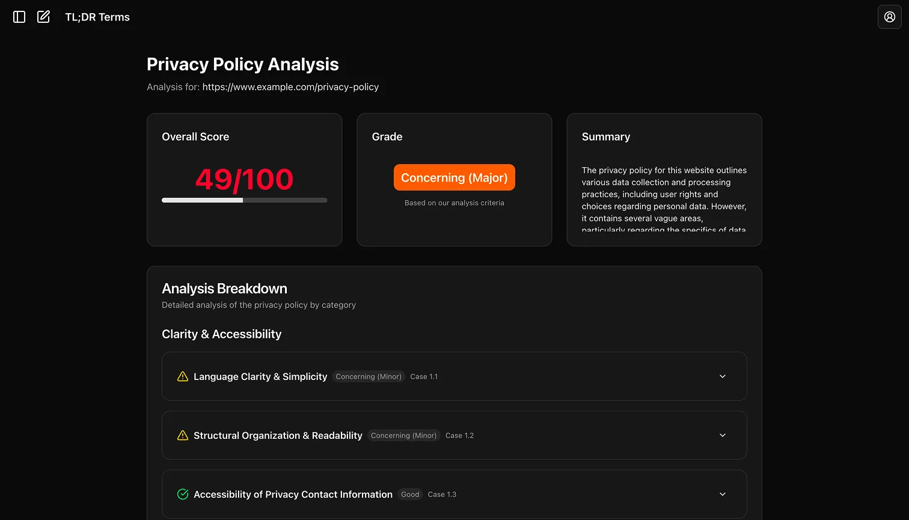

# TL;DR Terms

> AI-powered Terms of Service and Privacy Policy analyzer that helps you understand what you're agreeing to.

**Language:** English | [한국어](./README.ko.md)

---

🔗 **Live Demo:** [tldrterms.app](https://tldrterms.app)



## 🎯 Why This Exists

In today's digital landscape, users often accept lengthy Terms of Service and Privacy Policies without reading them, exposing themselves to serious privacy risks that threaten their personal data and digital rights.

### Real-World Examples:

**Roborock (2024, South Korea)**

- Changed their privacy policy to collect and process user data in China
- Most users were unaware because they didn't read the policy updates

**WhatsApp (2021, Global)**

- Announced mandatory data sharing with Facebook without opt-out option
- Caused massive backlash, resulting in 4.6M users migrating to Signal and 5M+ to Telegram within days
- Policy implementation was delayed 3 months due to public outcry

**The Problem:** People don't read terms because they're too long and complex. But that's exactly when companies slip in concerning changes.

**The Solution:** TL;DR Terms uses AI to read, analyze, and grade terms of service for you.

## ✨ Features

- 🔍 **URL Analysis** - Simply paste any terms/privacy policy URL
- 🤖 **AI-Powered Analysis** - Leverages OpenAI GPT for comprehensive evaluation
- 📊 **Scoring System** - Get an overall score (0-100) and letter grade
- 📝 **Detailed Breakdown** - Summary and analysis of key concerns
- 💾 **History Tracking** - Save and review your past analyses
- 🔎 **Search Functionality** - Find previous analyses by website name
- 🔐 **User Authentication** - Secure login and personal analysis history

## 🛠 Built With

- **Framework:** [Next.js 15](https://nextjs.org/)
- **Database & Auth:** [Supabase](https://supabase.com/)
- **AI:** OpenAI GPT
- **Language:** TypeScript
- **Styling:** Tailwind CSS
- **Deployment:** [Vercel](https://vercel.com/)

## 🚀 Getting Started

### Prerequisites

- Node.js 22+
- pnpm
- Supabase account
- OpenAI API key

### Installation

```bash
# Clone the repository
git clone https://github.com/iianjun/tldrterms.git

# Navigate to the project directory
cd tldrterms

# Install dependencies
pnpm install

# Set up environment variables
cp .env.example .env.local
# Add your Supabase and OpenAI credentials

# Run the development server
pnpm dev
```

Open [http://localhost:3000](http://localhost:3000) to view it in your browser.

### Environment Variables

Create a `.env.local` file with the following:

```env
OPENAI_API_KEY=your_openai_api_key
NEXT_PUBLIC_SUPABASE_URL=your_supabase_url
NEXT_PUBLIC_SUPABASE_ANON_KEY=your_supabase_anon_key
NEXT_PUBLIC_BASE_URL=your_base_url
API_URL=your_api_url
SUPABASE_SERVICE_ROLE_KEY=your_supabase_service_role_key
```

## 📁 Project Structure

```
tldrterms/
├── src/
│   ├── app/              # Next.js app directory (routes and layouts)
│   ├── assets/           # Lottie files & icon SVGs
│   ├── components/       # React components
│   ├── constants/        # Constants
│   ├── hooks/            # Custom React hooks
│   ├── lib/              # Utility functions and configurations
│   ├── providers/        # React providers (Query Client)
│   ├── services/         # API calls (apiClient)
│   ├── types/            # TypeScript types
│   ├── utils/            # Utility functions
│   └── validations/      # Zod schemas
└── public/               # Static assets
```

## 🔒 Privacy & Security

- All analyses are stored securely in Supabase
- User authentication via Supabase Auth
- Your data is never shared with third parties
- OpenAI API calls are server-side only

## 🌐 Deployment

This project is deployed on Vercel. Any push to the `main` branch triggers automatic deployment.

## 🤝 Contributing

Contributions are welcome! Please feel free to submit a Pull Request.

## 📄 License

This project is open source and available under the [MIT License](LICENSE).

## 📫 Contact

- **Website:** [tldrterms.app](https://tldrterms.app)
- **GitHub:** [@iianjun](https://github.com/iianjun)

---

⚠️ **Disclaimer:** While TL;DR Terms provides AI-powered analysis of terms and policies, it should not be considered legal advice. Always consult with a legal professional for important decisions.

---

⭐ If you find this project useful, please consider giving it a star on GitHub!
